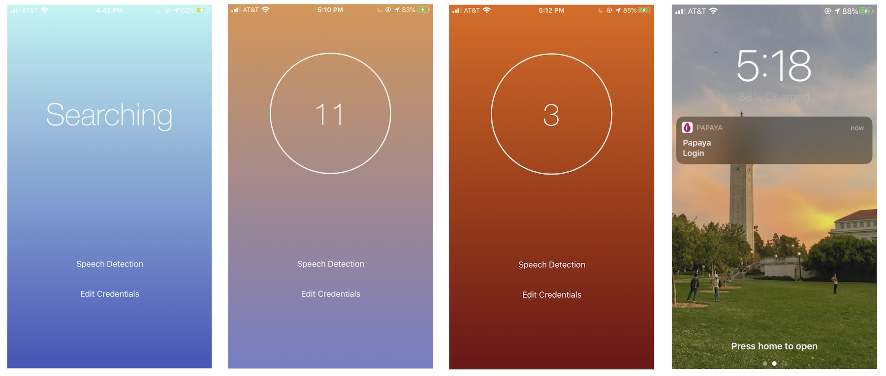

# Papaya

Using Papaya, when close to a medical computer in a clinic or hospital, a doctor can log into their EHR system using their iPhone. Background bluetooth will prompt them to authenticate with Touch ID or Face ID and then send a request to the Papaya IoT module to log them in.

